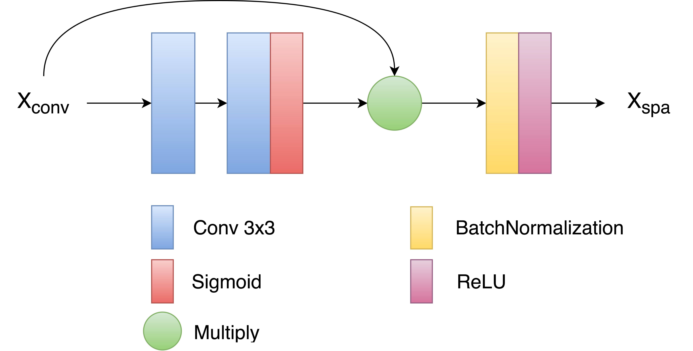
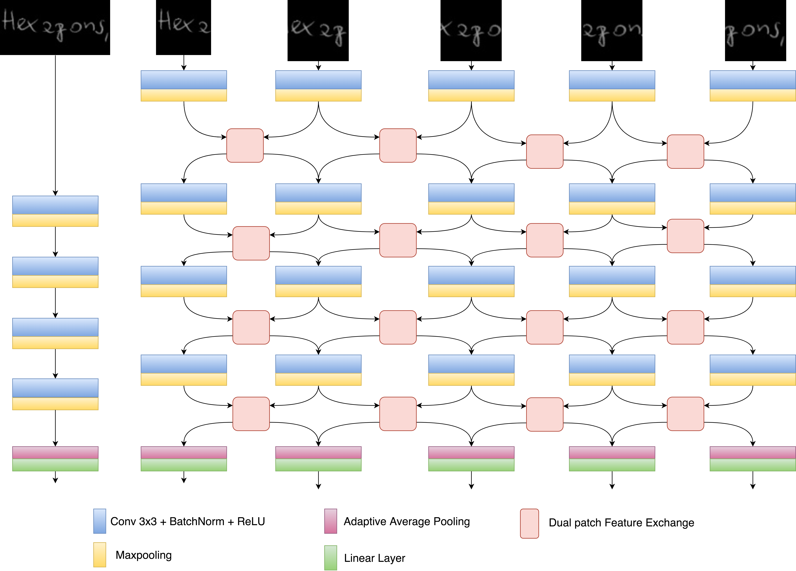

# Exploiting Multi-Scale Fusion, Spatial Attention and Patch Interaction Techniques for Text-Independent Writer Identification
This repository provides the code for our paper titled "Exploiting Multi-Scale Fusion, Spatial Attention and Patch Interaction Techniques for Text-Independent Writer Identification" Accepted at Asian Conference on Pattern Recognition 2021([arxiv version](https://arxiv.org/abs/2111.10605)) 
## 2.) Overview
### 2.1.)Introduction
Text independent writer identification is a challenging problem that differentiates between different handwriting styles to decide the author of the handwritten text. 
Earlier writer identification relied on handcrafted features to reveal pieces of differences between writers. Recent work with the advent of convolutional neural network,
deep learning-based methods have evolved. In this paper, three different deep learning techniques - spatial attention mechanism, multi-scale feature fusion and patch-based CNN 
were proposed to effectively capture the difference between each writer's handwriting. Our methods are based on the hypothesis that handwritten text images have specific spatial
regions which are more unique to a writer's style, multi-scale features propagate characteristic features with respect to individual writers and patch-based features give more
general and robust representations that helps to discriminate handwriting from different writers. The proposed methods outperforms various state-of-the-art methodologies on word
and page-level writer identification methods on the CVL, Firemaker, CERUG-EN datasets and give comparable performance on the IAM dataset. 

## 2.2.) Spatial Attention Unit in SA-Net


## 2.3.) MSRF-Classification Network Architecture


## 2.4.) PatchNet Architecture


## 4.) Citation
Please cite our paper if you find the work useful:

```
@article{srivastava2021exploiting,
  title={Exploiting Multi-Scale Fusion, Spatial Attention and Patch Interaction Techniques for Text-Independent Writer Identification},
  author={Srivastava, Abhishek and Chanda, Sukalpa and Pal, Umapada},
  journal={arXiv preprint arXiv:2111.10605},
  year={2021}
}

```
## 5.) FAQ
Please feel free to contact me if you need any advice or guidance in using this work ([E-mail](abhisheksrivastava2397@gmail.com)) 
